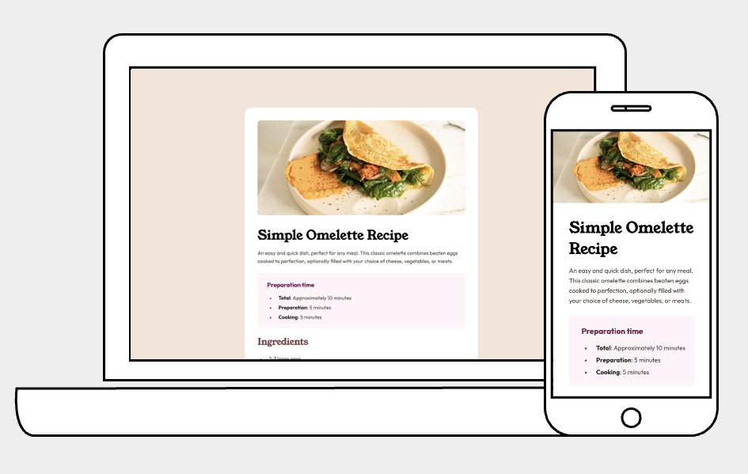

# Frontend Mentor - Recipe page solution

This is a solution to the [Recipe page challenge on Frontend Mentor](https://www.frontendmentor.io/challenges/recipe-page-KiTsR8QQKm). 

## Table of contents

- [Overview](#overview)
  - [Screenshot](#screenshot)
  - [Links](#links)
- [My process](#my-process)
  - [Built with](#built-with)
  - [What I learned](#what-i-learned)
- [Author](#author)

## Overview

### Screenshot



### Links

- Solution URL: [Add solution URL here](https://your-solution-url.com)
- Live Site URL: [Add live site URL here](https://your-live-site-url.com)

## My process

### Built with

- Semantic HTML5 markup
- Flexbox

### What I learned

During this challenge, I gained a deeper understanding of HTML `<table>` elements.

- One issue I encountered was the inability to display bottom borders for table rows in the following markup:
  ```html
  <div class="nutrition">
    <table>
      <tr>
        <td>Calories</td>
        <td>277kcal</td>
      </tr>
      <tr>
        <td>Carbs</td>
        <td>0g</td>
      </tr>
      <tr>
        <td>Protein</td>
        <td>20g</td>
      </tr>
      <tr>
        <td>Fat</td>
        <td>22g</td>
      </tr>
    </table>
  </div>
  ```
  ```css
  /* Original approach: unable to display the bottom border of the table */
  .nutrition tr {
      border-bottom: 1px solid hsl(30, 18%, 87%);
  }

  /* Solution */
  .nutrition table {
      border-collapse: collapse; /* Combine table borders */
  }

  .nutrition tr {
      border-bottom: 1px solid hsl(30, 18%, 87%);
  }
  ```

- To add borders only between table rows, excluding the last row:
  ```css
  .nutrition tr:not(:last-child) {
      border-bottom: 1px solid hsl(30, 18%, 87%);
  }
  ```

- For changing the font color of the second column:
  ```css
  .nutrition td:nth-child(2) {
      color: blue;
  }
  ```

## Author

Frontend Mentor - [@Chih-Hsuan Lee](https://www.frontendmentor.io/profile/brownrice-02)
